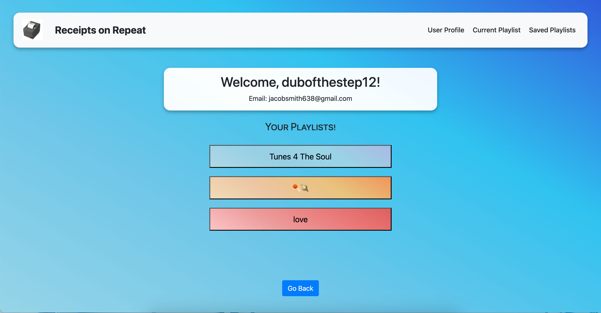
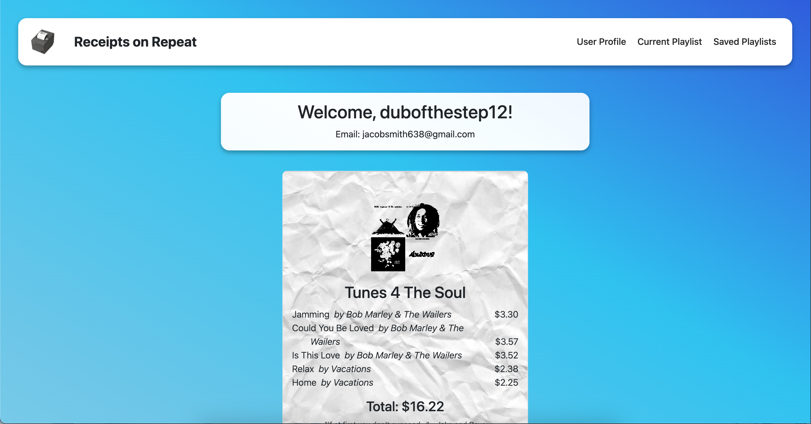
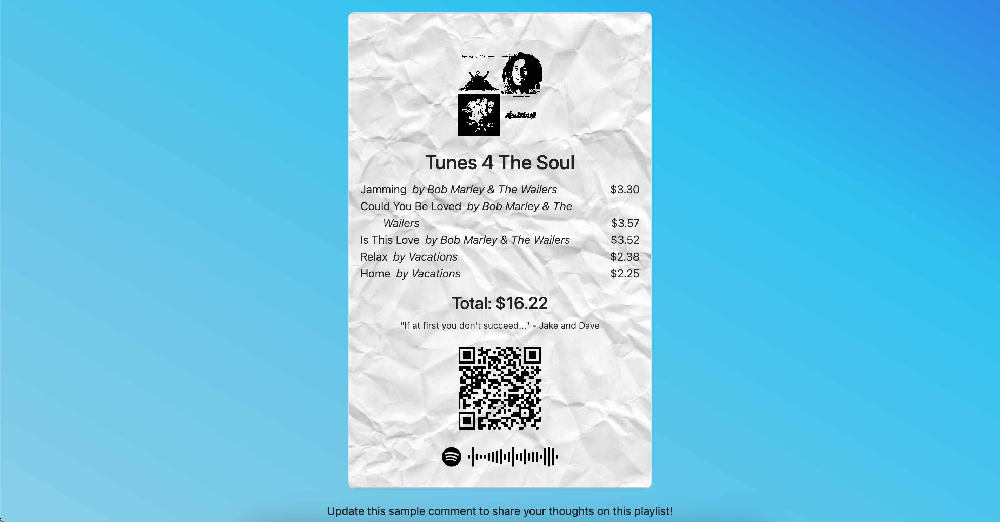

# receipts-on-repeat-reloaded

## Description

Our motivation for creating Receipts on Repeat was to take a concept we'd seen others do manually, where they take an albnum or playlist and format it like a store receipt, but we wanted to automate this process by allowing the user to connect with Spotify and our app would automatically format their playlists for them.

Users can quickly and easily generate a formatted receipt that lists the playlist name, song titles, artists, and even album art, transformed and manipulated to look right at home coming out of a receipt printer. We've even generated a QR code with a link to the playlist, and included the "Spotify Code" that users can scan with their phone camera through the Spotify mobile app.

Through the development of this app, we were able to hone our skills working with APIs, using OAuth2 for authentication, and gained experience in front-end development, focusing on making an app that is user-friendly and visually appealing. 

Through working with each other, we were able to test and improve our collaborative skills as developers, and further reinforce the importance of communication and implementation of task delegation in a team setting.

## Table of Contents

- [Installation](#installation)
- [Usage](#usage)
- [Credits](#credits)
- [License](#license)

## Installation

Rename the `.env.EXAMPLE` file to `.env`.

You will need a Spotify account to use the features of the app other than viewing playlists that are already saved in the database. You'll need to register your app with [Spotify for Developers](https://developer.spotify.com) so that you can get a `CLIENT_ID` and `CLIENT_SECRET` to enter into your `.env` variable. You'll also need to specify a Redirect URI when creating the app, and make sure it matches the `REDIRECT_URI` contained in your `.env` file. You can find instructions on how to do this [here](https://developer.spotify.com/documentation/web-api/tutorials/getting-started).

For local use:
- run the following commands `npm install` `npm run seed` `npm run build` `npm run develop` to run the program and start the server/database. 
- you will not need to specify anything for the `MONGODB_URI` `NODE_ENV` variables in the `.env` file.
- you will need MongoDB Compass installed and connected, but you do not need to specify any additional settings to use it. 
    - The app will choose a name and create the database for you
    - By running the `npm run seed` command, the database will automatically be cleared out and will populate a sample receipt with the playlist title "music for ducks".

In production (deployed):
- use `npm run render-build` for the build command, and `npm run start` for the start command. 
- you will need to specify a [MongoDB Atlas](https://www.mongodb.com/lp/cloud/atlas/try4-reg?utm_source=google&utm_campaign=search_gs_pl_evergreen_atlas_core-high-int_prosp-brand_gic-null_amers-us_ps-all_desktop_eng_lead&utm_term=mongodb%20atlas&utm_medium=cpc_paid_search&utm_ad=e&utm_ad_campaign_id=19609124046&adgroup=145188748043&cq_cmp=19609124046&gad_source=1&gbraid=0AAAAADQ14028l1L2sN5EuDw5FkjntiWZ6&gclid=Cj0KCQiAu8W6BhC-ARIsACEQoDAT5d2oE7bTUWE9GArvChKImwk9xOAXw7kg-khjL5oIwOyGpEGtNAUaAgpxEALw_wcB) cluster driver connection link for the `MONGODB_URI` variable.
- you will need to specify `production` for the `NODE_ENV` variables.

## Usage

## Credits

Links to our GitHub profiles: [Jacob Smith](https://github.com/5mitty) & [David Cartolano](https://github.com/dcartolano)

## License

MIT